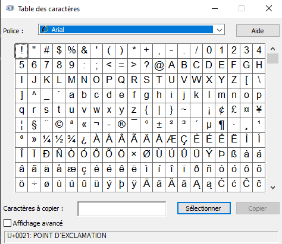
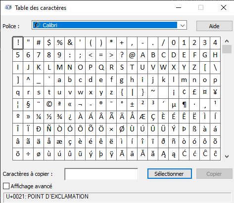

# L'ordinateur

## Fonctionnement général

### La mémoire et le disque dur

ROM : Hardware (BIOS, ...)
-> Pas d'interaction directe avec le code
-> L'OS se trouve entre le hardware et le logiciel

RAM : Mémoire volatile
-> Rapide
-> Stockage des variables, tableaux, objets
-> Cache, bases de données volatiles (REDIS)
-> Code des programmes en cours d'exécution

Disque dur, Clé USB : Fichiers, Base de données relationnelles (MySQL, PostgreSQL)

### Le processeur central

Exécution des instructions des programmes applicatifs, l'OS.

### La carte graphique

Affichage de l'interface.
Elle possède aussi un processeur, à la différence du processeur central, il est construit (architecturé) pour optimiser l'affichage.
De part cette construction, il est très utilisé pour faire de l'IA et aussi pour miner des cryptomonnaies.

### L'interface homme / machine

Le clavier avec différents type de touches
- Alphanumérique (Majuscules et Minuscules)
- Les caractères spéciaux (dont la ponctuation)
- Les touches de fonction (F1 à F12)
- Les raccourcis (CTRL, ALT, ALT GR, MAJ, WINDOWS / APPLE)

La souris avec
- Deux boutons gauche et droite
- Une molette avec parfois un bouton

L'écran
- Affichage de l'interface graphique avec laquelle l'utilisateur interagit au moyen du clavier et de la souris

## Encodage de l'information au sein d'un ordinateur

- Bit : 0 ou 1
- Octet : 8 bits
- Kilo octet : 1 000 octets
- Méga octet : 1 000 kilo octets
- Giga octet : 1 000 méga octets
- Téra octet : 1 000 giga octets
- Teta octet : 1 000 téra octets

### Encodage des caractères
L'encodage consiste à déterminer quelle suite de bits (0 ou 1) on fait correspondre à un caractère saisi au clavier.

Je tape une lettre sur mon clavier, l'ordinateur encode une valeur numérique correspondant à la lettre suivant une norme (ex: UNICODE), cette information est stockée sous forme de 0 et 1 dans la mémoire et le disque, pour restituer (afficher) cette information à l'utilisateur, la lettre est dessinée à l'écran (c'est la font qui fait le lien entre code et dessin). L'utilisateur retrouve alors le sens de l'information.




### UNICODE
Le plus courant et massivement utilisé
Déclinaison entre UTF-8, UTF-16 et UTF-32
-> Encodage sur 8 bits, 16 bits, 32 bits

Autre format de caractères souvent rencontré : ASCII

### Les couleurs

Les différents codes couleurs:
- Hexadécimal (3 ou 6 caractères) #FFFFFF ou #FFF
- RGB : Red / Green / Blue (0-255 / 0-255 / 0-255)
- HSL : Hue / Saturation / Lightness (Teinte saturation luminosité)
- Alpha : opacité

Installation et utilisation d'un plugin pipette sur le navigateur
https://chrome.google.com/webstore/detail/ultimate-color-picker/clkoagfbjkilljcajbbielofkeokbhma

### Les images

Les deux familles: bitmap et vectoriels

#### BITMAP
Stockage de la couleur de chaque pixel de l'image

Rapport poids des images par rapport à du texte:
une images bitmap RGB de 100px sur 100px = 30000 octets (non compressée)

Les différents types de compressions des images:
- compression destructive pour JPEG
- compression non destructive pour PNG

#### SVG
Stockage de traits, formes, textes, vides ou remplies

```svg
<svg height="100" width="100">
  <circle cx="50" cy="50" r="40" stroke="black" stroke-width="3" fill="red" />
  <polygon points="100,10 40,198 190,78 10,78 160,198" style="fill:lime;stroke:purple;stroke-width:5;fill-rule:nonzero;"/> 
</svg> 

```
https://www.w3schools.com/graphics/svg_examples.asp
